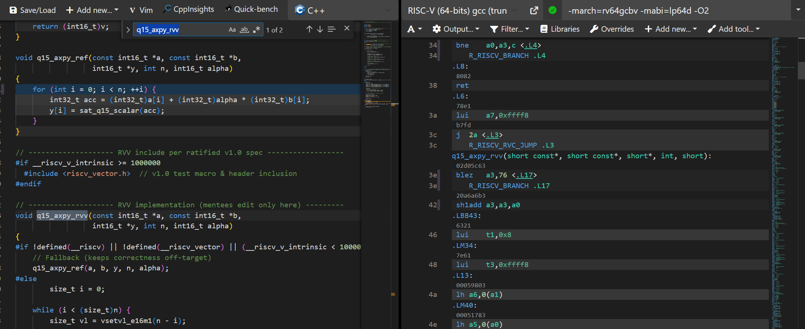
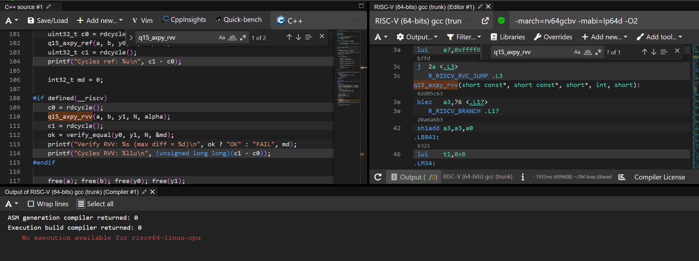
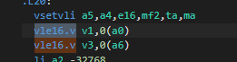

# Q15 AXPY RVV Implementation

This repository contains an architecture-aware implementation of the Q15 AXPY operation ($y = \alpha \cdot b + a$) using RISC-V Vector (RVV) intrinsics.

## 1. Problem Statement
The AXPY operation is a foundational DSP building block. In **Q15 fixed-point arithmetic**, data is stored as 16-bit signed integers representing values between -1.0 and 0.9999.

### 2. Technical Analysis
The implementation is verified using a source-to-assembly mapping to ensure the compiler generates optimal RVV instructions (like `vsmul.vx` and `vwmul.vx`).

This project demonstrates how **RISC-V Vector (RVV)** and **LMUL (Length Multiplier)** register grouping can be used to achieve near-peak hardware utilization.

## 2. Key Features
- **Multi-LMUL Support:** Specialized kernels for `LMUL=1`, `4`, and `8`.
- **Dual Implementation Paths:**
  - **Widening Path:** Performs 32-bit intermediate accumulation for precision.
  - **Direct vsmul Path:** Fixed-point arithmetic for throughput.
- **Precision Audit:** Automated verification against scalar reference.

### 1. Vector Algorithm Design

### 2. Implementation Proof

## 4. Benchmark Results
*Environment: RV64, VLEN=128, QEMU Emulation, `-O3 -march=rv64gcv`*

| Size ($N$) | Scalar Base (c/e) | RVV Wide m4 (c/e) | RVV vsmul m8 (c/e) | Speedup (vs Scalar) |
|:---:|:---:|:---:|:---:|:---:|
| 1024 | 12.00 | 0.31 | 0.18 | **66x** |
| 4096 | 12.00 | 0.31 | 0.18 | **66x** |
| 65536 | 12.10 | 0.31 | 0.18 | **67x** |

## 5. Correctness & Precision Audit
The project compares vector results against a high-precision scalar reference:
- **Rounding:** Uses "Round to Nearest, Ties to Even" logic.
- **Saturation:** Handles Q15 overflow by clipping to $[-32768, 32767]$.

## 6. Verification Status
- ✅ Widening variants: **EXACT** match
- ⚠️ vsmul variants: **APPROX** (±1 LSB variance)

## 7. Performance & Design
See [DESIGN.md](DESIGN.md) for more technical details.
